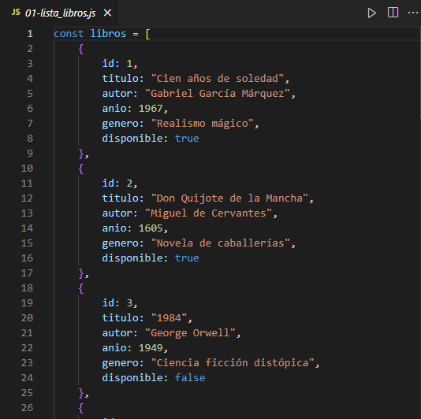
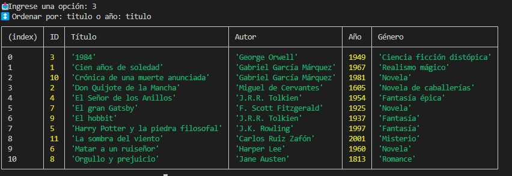
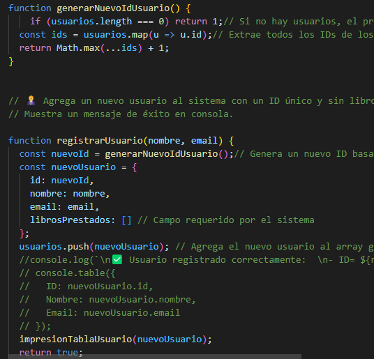
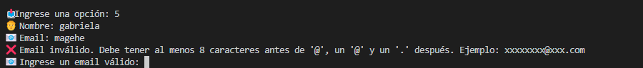
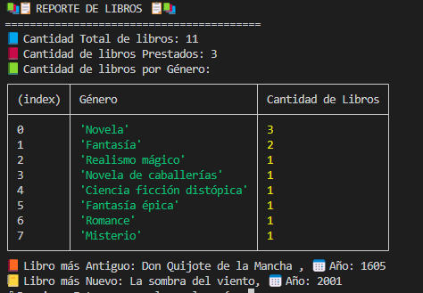
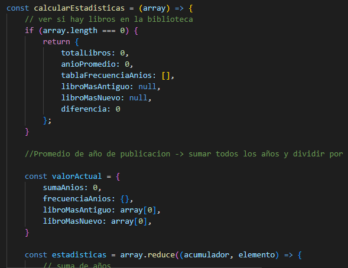
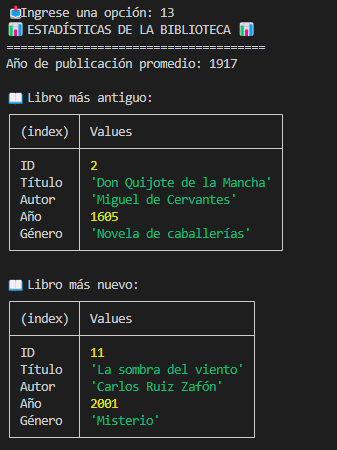
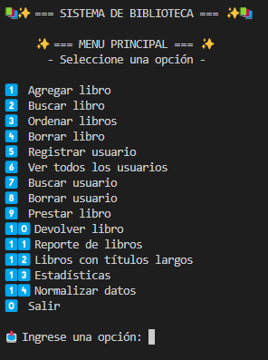

<p align="center">
  
</p>

# <p align="center">  Sistema de Gestión de Biblioteca </p> 

Este proyecto consiste en una aplicación desarrollada en **JavaScript** puro para la gestión de una biblioteca. 

## ✨ Características destacadas del sistema

Este sistema ha sido desarrollado respetando los puntos establecidos como **MVP (Producto Mínimo Viable)**. A partir de esa base, se han incorporado funcionalidades adicionales que mejoran la experiencia de uso, así como **comprobaciones y validaciones** para garantizar un funcionamiento robusto y seguro frente a errores del usuario.

- **Gestión de usuarios**:
  - El **ID de usuario** se genera de forma **incremental automática**, asegurando unicidad y facilitando su gestión.
  - Al intentar eliminar un usuario, el sistema verifica que **no tenga préstamos activos**. En caso contrario, la eliminación se aborta para preservar la integridad del sistema.

- **Gestión de libros**:
  - Para las operaciones de eliminación, se trabaja sobre una **copia del array original de libros**, lo cual evita mutaciones indeseadas.
  - Se utiliza una función auxiliar específica que **verifica si el libro se encuentra prestado**. Si está en préstamo, su eliminación se bloquea automáticamente.
  - Se implementa `console.table()` para presentar información de forma clara y visual en la consola, especialmente útil al listar libros o usuarios.

- **Visualización de datos**:
  - En los reportes de usuarios con préstamos, se muestra el **ID del libro prestado** junto con su **título**, mejorando significativamente la legibilidad y comprensión de los datos desde consola.

---

## 🎯 Objetivo

Desarrollar un sistema funcional que permita administrar libros, usuarios y préstamos, aplicando conceptos de estructuras de datos, algoritmos, validaciones y manejo de consola en JavaScript.

---
## 🚀 Funcionalidades principales

1. **Gestión de libros**  
   - Alta, búsqueda, ordenamiento (bubble sort) y baja lógica de libros.  
2. **Gestión de usuarios**  
   - Registro, consulta y eliminación lógica con validaciones.  
3. **Sistema de préstamos**  
   - Préstamos y devoluciones con actualización automática del estado del libro y usuario.  
4. **Reportes estadísticos**  
   - Análisis con métodos `map`, `filter` y `reduce`.  
5. **Manejo avanzado de datos**  
   - Normalización de cadenas, validación y limpieza.  
6. **Interfaz de usuario por consola**  
   - Menú interactivo usando `prompt()` y estructura `switch`.

---

## 🗂️ Estructura del proyecto

- `00-funciones_auxiliares.js`: Funciones auxiliares reutilizables.  
- `01-lista_libros.js`: Array con datos iniciales de libros.  

<p align="center">
  
  <br/>
  <em>array de Libros</em>
</p>

- `01-lista_usuarios.js`: Array con datos iniciales de usuarios.  
- `02-gestion_libro.js`: Funciones para manejar libros.  

<p align="center">
  
  <br/>
  <em>Ejemplo: Búsqueda de libro según elección del usuario</em>
</p>

- `03-gestion_usuario.js`: Funciones para manejar usuarios.  
<p align="center">
  
  <br/>
  <em>Ejemplo: funcion generarNuevoIdUsuario y registrarUsuario</em>
</p>

En las funciones declaradas, se hace manejo de errores para un correcto funcionamiento del sistema:
<p align="center">
  
  <br/>
  <em>Error: ingreso de mail sin @ y .</em>
</p>

- `04-sistema_prestamos.js`: Funciones para préstamos y devoluciones.  
- `05-reportes.js`: Funciones para reportes estadísticos.  
- `06-identificacion_libro.js`: Funciones avanzadas de identificación de libros.  

<p align="center">
  
  <br/>
  <em>Salida por consola</em>
</p>

- `07-calculos_estadisticos.js`: Funciones para cálculos matemáticos y estadísticos.  

<p align="center">
  
  
  <br/>
  <em>Código y salida por consola de estadísticas de libros</em>
</p>


- `08-manejo_cadenas.js`: Normalización y manipulación de strings.  
- `09-menu.js`: Menú interactivo y punto de entrada al programa. 
<p align="center">
  
  <br/>
  <em>node 09-menu.js</em>
  <br/>
  <em>Salida por consola: Menu</em>
</p> 

- `documentacion/`: Documentos relacionados al flujo de trabajo y validaciones.

- `image/`: Imagenes PNG necesarias para el README.md.

- `README.md`: Documentación principal del proyecto.

---
## 🧪 Requisitos para ejecutar

- Tener instalado **Node.js**
- Clonar el repositorio:

> ⚠️ **Nota:** Si se corre el programa en una terminal **Bash**, algunos iconos pueden no visualizarse correctamente. Se recomienda usar **PowerShell** para una mejor experiencia.


```bash
git clone https://github.com/magamahe/Sistema_Gestion_Biblioteca.git
cd Sistema_Gestion_Biblioteca
node 09-menu.js
```

---

## 📌 Notas adicionales

- El sistema fue diseñado sin frameworks, como ejercicio práctico del uso de estructuras básicas en JavaScript.
- El proyecto sigue el flujo de trabajo colaborativo con ramas individuales por desarrolladora y fusiones mediante Git.

---
## 🛠️ Tecnologías usadas

<p>
  
  
  
  
</p>

---

## 🧑‍💻 Autoras

- **BORGOGNO, Antonela**

  [](https://www.linkedin.com/in/antonela-borgogno/)  
  [](https://github.com/Antonela89)

- **MARTINEZ, Gabriela**

  [](https://www.linkedin.com/in/magamahe/)  
  [](https://github.com/magamahe)


## 📄 Licencia
<p align="center">
  
<center> Programa de formación en desarrollo web, Cohorte intro-js-202504  </center>

Proyecto educativo sin fines comerciales. Todos los derechos reservados © 2025.

---
